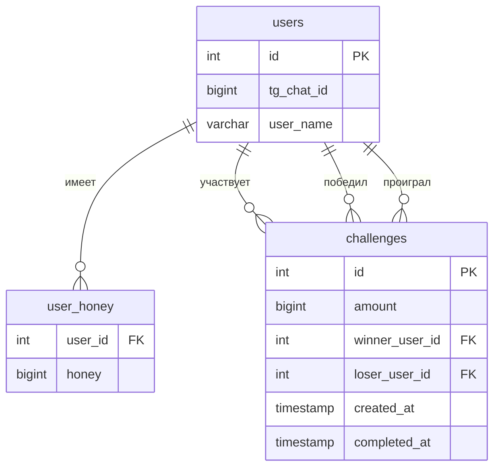

# Схема БД HoneyGame

## Обзор

Проект использует PostgreSQL с отдельной схемой `honey`.

## Таблицы

## Детали таблиц

### `honey.users`

| Поле | Тип | Описание |
|------|-----|----------|
| id | SERIAL | Первичный ключ |
| tg_chat_id | BIGINT | ID чата в Telegram (уникальный) |
| user_name | VARCHAR(255) | Имя пользователя |

### `honey.user_honey`

| Поле | Тип | Описание |
|------|-----|----------|
| user_id | INTEGER | Внешний ключ на users (PK) |
| honey | BIGINT | Баланс меда |

### `honey.challenges`

| Поле | Тип | Описание |
|------|-----|----------|
| id | SERIAL | Первичный ключ |
| amount | BIGINT | Количество меда в ставке |
| winner_user_id | INTEGER | ID победителя |
| loser_user_id | INTEGER | ID проигравшего |
| created_at | TIMESTAMP | Время создания вызова |
| completed_at | TIMESTAMP | Время завершения (NULL — не завершён) |

## Индексы

- `idx_challenges_winner` — по `winner_user_id`
- `idx_challenges_loser` — по `loser_user_id`
- `idx_challenges_completed_at` — по `completed_at`

## Миграции

- **up:** `migrations/up.sql`
- **down:** `migrations/down.sql`
