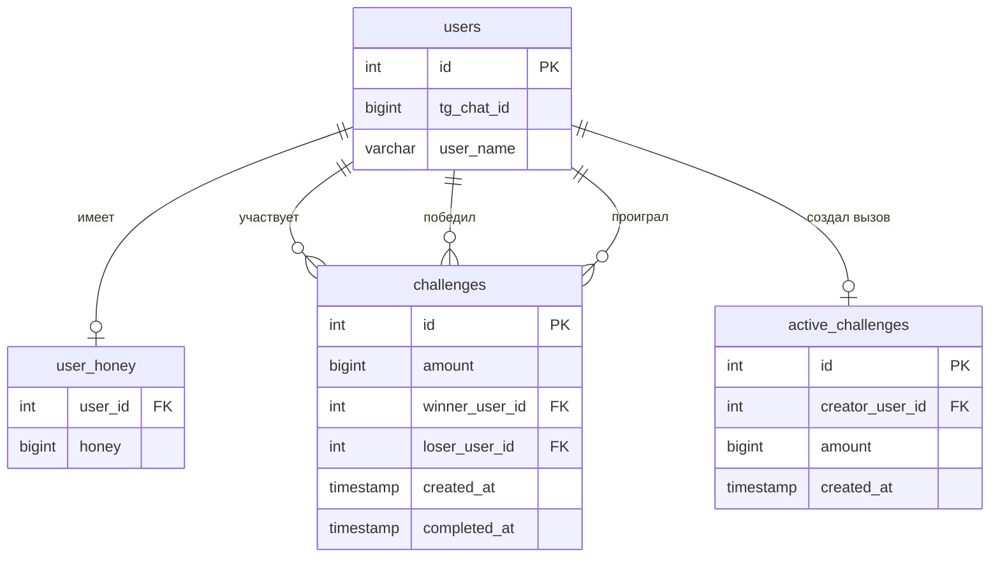

# Схема БД HoneyGame

## Обзор

Проект использует PostgreSQL с отдельной схемой `honey`.

## Таблицы

## Детали таблиц

### `honey.users`

| Поле | Тип | Описание |
|------|-----|----------|
| id | SERIAL | Первичный ключ |
| tg_chat_id | BIGINT | ID чата в Telegram (уникальный) |
| user_name | VARCHAR(255) | Имя пользователя |

### `honey.user_honey`

| Поле | Тип | Описание |
|------|-----|----------|
| user_id | INTEGER | Внешний ключ на users (PK) |
| honey | BIGINT | Баланс мёда |

Заметки:
- при регистрации пользователя код создаёт запись с балансом `15` (стартовый бонус за регистрацию);
- схема остаётся с `DEFAULT 0` как нейтральная страховка для восстановления потерянной записи (`/start` дозаполняет отсутствующую строку с дефолтом).

### `honey.challenges`

Журнал завершённых боёв.

| Поле | Тип | Описание |
|------|-----|----------|
| id | SERIAL | Первичный ключ |
| amount | BIGINT | Количество мёда в ставке |
| winner_user_id | INTEGER | ID победителя |
| loser_user_id | INTEGER | ID проигравшего |
| created_at | TIMESTAMP | Время создания вызова |
| completed_at | TIMESTAMP | Время завершения |

### `honey.active_challenges`

Открытые вызовы (миграция `000002_add_active_challenges`). Ставка созда-
теля списывается с баланса в момент создания вызова и возвращается при
отзыве — таблица является «банком» активных ставок.

| Поле | Тип | Описание |
|------|-----|----------|
| id | SERIAL | Первичный ключ |
| creator_user_id | INTEGER | ID создателя вызова (UNIQUE, FK на users, CASCADE) |
| amount | BIGINT | Ставка, CHECK (amount > 0) |
| created_at | TIMESTAMP WITH TIME ZONE | Время создания |

Заметки:
- `UNIQUE (creator_user_id)` — у одного игрока максимум один активный вызов;
- удаление строки происходит в момент боя (ставка разыгрывается) или отзыва (ставка возвращается).

## Индексы

- `idx_challenges_winner` — по `winner_user_id`
- `idx_challenges_loser` — по `loser_user_id`
- `idx_challenges_completed_at` — по `completed_at`
- `idx_active_challenges_creator` — по `creator_user_id` (в дополнение к UNIQUE)

## Миграции

Каталог `migrations/`, пары `NNNNNN_name.up.sql` / `NNNNNN_name.down.sql`:

- **000001_init** — схема `honey`, таблицы `users`, `user_honey`, `challenges`, индексы
- **000002_add_active_challenges** — таблица `active_challenges` + индекс
